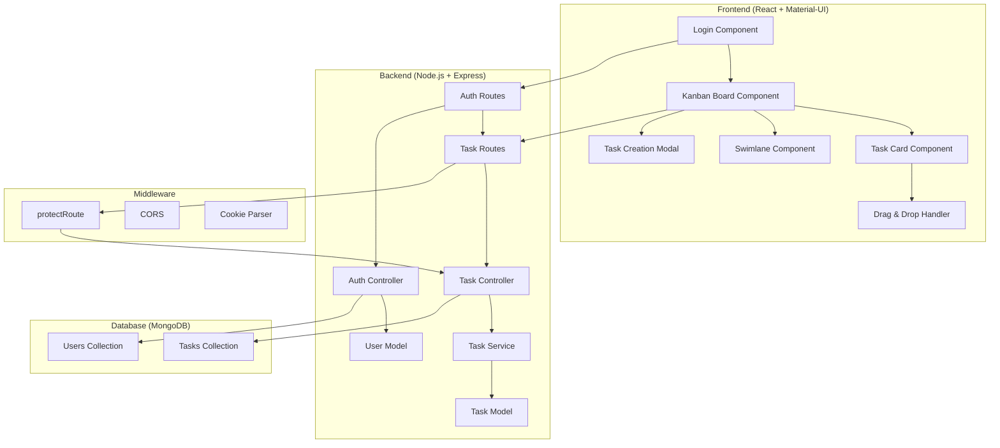

# Design Document

## Overview

The Kanban Task Manager is a single-user task management application built on a Node.js/Express backend with MongoDB and a React frontend using Material-UI. The system follows a traditional three-tier architecture with clear separation between presentation, business logic, and data layers. The application leverages existing authentication infrastructure and extends it with task management capabilities.

The core functionality centers around a Kanban board interface where users can create, view, and manage task cards across three swimlanes: "To-Do", "In Progress", and "Completed". The system supports drag-and-drop interactions for seamless task state transitions.

## Architecture

### System Architecture



### Technology Stack

- **Frontend**: React 18, Material-UI, React Router DOM, React DnD (for drag-and-drop)
- **Backend**: Node.js, Express.js, JWT authentication, bcryptjs
- **Database**: MongoDB with Mongoose ODM
- **Development**: Vite (frontend), Nodemon (backend)

## Components and Interfaces

### Frontend Components

#### 1. KanbanBoard Component
- **Purpose**: Main container for the task management interface
- **Props**: None (fetches data internally)
- **State**: 
  - `tasks`: Array of all tasks
  - `loading`: Boolean for loading state
  - `error`: Error message string
- **Key Methods**:
  - `fetchTasks()`: Retrieves all tasks from API
  - `handleTaskMove(taskId, newStatus)`: Updates task status via API
  - `handleTaskCreate(taskData)`: Creates new task via API

#### 2. Swimlane Component
- **Purpose**: Represents a single column (To-Do, In Progress, Completed)
- **Props**: 
  - `title`: String (column title)
  - `tasks`: Array of tasks for this status
  - `status`: String (task status identifier)
  - `onTaskMove`: Function callback for task movement
- **Features**: Drop zone for drag-and-drop operations

#### 3. TaskCard Component
- **Purpose**: Individual task representation
- **Props**:
  - `task`: Task object with id, title, description, status, createdAt
  - `onEdit`: Function callback for task editing
  - `onDelete`: Function callback for task deletion
- **Features**: Draggable, displays task information, edit/delete actions

#### 4. TaskModal Component
- **Purpose**: Form for creating and editing tasks
- **Props**:
  - `open`: Boolean for modal visibility
  - `task`: Task object (null for creation, populated for editing)
  - `onClose`: Function callback for modal close
  - `onSubmit`: Function callback for form submission
- **Features**: Form validation, Material-UI form components

#### 5. DragDropProvider Component
- **Purpose**: Wraps the application with drag-and-drop context
- **Implementation**: Uses React DnD library
- **Features**: Provides drag-and-drop functionality to child components

### Backend API Endpoints

#### Task Routes (`/api/tasks`)
- `GET /api/tasks` - Retrieve all tasks for authenticated user
- `POST /api/tasks` - Create new task
- `PUT /api/tasks/:id` - Update existing task
- `DELETE /api/tasks/:id` - Delete task
- `PATCH /api/tasks/:id/status` - Update task status (for drag-and-drop)

#### Authentication Routes (Existing)
- `POST /api/auth/login` - User login
- `POST /api/auth/logout` - User logout
- `POST /api/auth/signup` - User registration

### API Request/Response Formats

#### Task Object
```json
{
  "id": "string",
  "title": "string",
  "description": "string",
  "status": "todo" | "in-progress" | "completed",
  "assignee": "user_id",
  "createdAt": "ISO_date_string",
  "updatedAt": "ISO_date_string"
}
```

#### Create Task Request
```json
{
  "title": "string (required)",
  "description": "string (optional)"
}
```

#### Update Task Status Request
```json
{
  "status": "todo" | "in-progress" | "completed"
}
```

## Data Models

### Enhanced Task Model
```javascript
const taskSchema = new mongoose.Schema({
  assignee: {
    type: mongoose.Schema.Types.ObjectId,
    ref: "User",
    required: true
  },
  title: {
    type: String,
    required: true,
    trim: true,
    maxLength: 200
  },
  description: {
    type: String,
    trim: true,
    maxLength: 1000,
    default: ""
  },
  status: {
    type: String,
    enum: ["todo", "in-progress", "completed"],
    default: "todo"
  },
  priority: {
    type: String,
    enum: ["low", "medium", "high"],
    default: "medium"
  }
}, { 
  timestamps: true 
});
```

### User Model (Existing)
- Already implemented with username, email, password, profile image
- No modifications needed for task management functionality

### Database Relationships
- **User → Tasks**: One-to-many relationship
- **Task.assignee** references **User._id**
- Tasks are filtered by assignee for single-user experience

## Error Handling

### Frontend Error Handling
- **Network Errors**: Display toast notifications for API failures
- **Validation Errors**: Show inline form validation messages
- **Authentication Errors**: Redirect to login page
- **Drag-and-Drop Errors**: Revert task position and show error message

### Backend Error Handling
- **Validation Errors**: Return 400 with detailed field errors
- **Authentication Errors**: Return 401 with clear error messages
- **Authorization Errors**: Return 403 for accessing other users' tasks
- **Not Found Errors**: Return 404 for non-existent tasks
- **Server Errors**: Return 500 with generic error message (log details)

### Error Response Format
```json
{
  "error": "string",
  "details": "string (optional)",
  "field": "string (for validation errors)"
}
```

## Testing Strategy

### Frontend Testing
- **Unit Tests**: Individual component testing with React Testing Library
- **Integration Tests**: Component interaction testing
- **E2E Tests**: Full user workflow testing with drag-and-drop scenarios
- **Key Test Scenarios**:
  - Task creation and validation
  - Drag-and-drop functionality
  - Authentication flow
  - Error state handling

### Backend Testing
- **Unit Tests**: Controller and service layer testing
- **Integration Tests**: API endpoint testing with test database
- **Authentication Tests**: JWT token validation and middleware testing
- **Key Test Scenarios**:
  - CRUD operations for tasks
  - Task status updates
  - User authorization
  - Input validation

### Test Data Management
- **Frontend**: Mock API responses for component testing
- **Backend**: Separate test database with seed data
- **Test Utilities**: Helper functions for creating test users and tasks

## Security Considerations

### Authentication & Authorization
- JWT tokens stored in HTTP-only cookies
- Route protection middleware for all task endpoints
- User can only access their own tasks

### Input Validation
- Server-side validation for all task inputs
- XSS prevention through input sanitization
- SQL injection prevention through Mongoose ODM

### Data Protection
- Password hashing with bcryptjs
- Secure cookie configuration
- CORS configuration for frontend-backend communication

## Performance Considerations

### Frontend Optimization
- React.memo for task card components to prevent unnecessary re-renders
- Debounced search functionality
- Lazy loading for large task lists
- Optimistic updates for drag-and-drop operations

### Backend Optimization
- Database indexing on user ID and task status
- Pagination for large task lists
- Efficient MongoDB queries with proper projections
- Response caching for static data

### Real-time Updates (Future Enhancement)
- WebSocket integration for real-time task updates
- Optimistic UI updates with rollback on failure